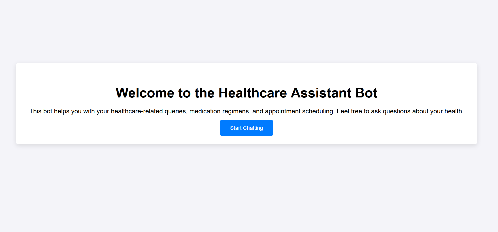
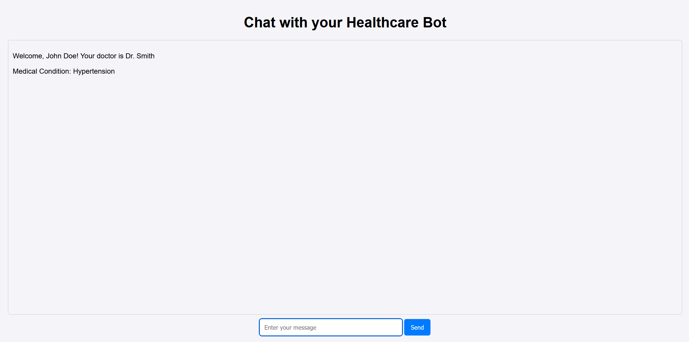

# Healthcare-Bot

Healthcare Chatbot with Appointment Scheduling & Medical Insights

## Overview:
This project is designed to streamline patient-doctor communication in healthcare environments through an intelligent chatbot interface. Built on the Django framework, the chatbot assists patients in scheduling or rescheduling medical appointments and helps manage treatment protocols. The chatbot can interpret patient requests in natural language using Large Language Models and can also provide healthcare-related insights.

The primary focus of this project is the seamless interaction between the patient and healthcare provider. When a patient requests a change to their appointment (e.g., rescheduling), the bot responds appropriately by acknowledging the request and notifying the healthcare provider. Simultaneously, the bot also extracts relevant entities from the conversations with the patient.

### Tech Stack:
The backend leverages Django as the primary framework, offering robust support for rapid development and secure handling of requests. It integrates with PostgreSQL for persistent data storage, maintaining patient details, appointment schedules, and medical records. Despite the usage of PostgreSQL, the application is built to be as stateless as possible, ensuring scalability and flexibility. Each interaction between the chatbot and the patient is processed in isolation, minimizing dependency on server state.

The frontend UI is built using simple HTML, inline CSS, and inline JavaScript to ensure responsiveness and a smooth user experience. Additionally, the design is LLM-agnostic. While the Gemini model is currently in use, the system can easily be adapted to any other large language model with just a change in environment variables. The Factory Design Pattern is implemented to ensure seamless integration of different LLMs without requiring any code modifications.

## Features implemented:
- **Patient Model**: Implemented using Django ORM, with data stored in PostgreSQL. For simplicity, only one record is inserted with fields like First Name, Last Name, Date of Birth, Phone Number, Email, Medical Condition, Medication Regimen, and Appointment details.

- **Main View**: The primary interface includes a chat box that displays conversation history with date and time stamps, allowing the patient to interact with the AI bot.

- **AI Bot Functionality**: The bot responds to health-related queries such as lifestyle advice, medication inquiries, and appointment requests. Non-health-related topics are filtered out.

- **Conversation History**: Conversation history is preserved within each session, and the last 10 messages are passed to the LLM to maintain context while optimizing memory usage.

- **Entity Extraction**: Key entities such as medication names, appointment times, and patient preferences are extracted from the conversation to assist the doctor.

#### Bonus Features
- **Multi-Agent System**: Although constrained to the *Gemini* model due to free resource limitations, a template code has been prepared to support OpenAI in the future, enabling the application to scale to multiple agents.

- **Conversation Summaries and Medical Insights**: After every 10 messages, the system calls the LLM for a summary of the conversation, which helps retain context and offers medical insights.

- **LLM-Agnostic Design**: The application is designed to swap LLMs easily by changing environment variables. If new models are to be added in the future, they can be readily added in the */ai_models* directory.

## Getting Started
### Prerequisites
Before you begin, ensure you have the following installed:

- Python 3.9+
- PostgreSQL 
- Django 4.0+
- Gemini API Key (https://aistudio.google.com/app/apikey)
- .env file

For security an best practices, it is expected from the developer to manually create a .env file to store and use the environment variables. The ideal .env file should look something like this:
```
# Chatbot variables
CHATBOT_MODEL="gemini"
CHATBOT_API_KEY="gemini-api-key"

# Postgres variables
DB_NAME=healthcare_db
USER=postgres
PASSWORD=123
HOST=localhost
PORT=5432
```

### Installation
1. Clone the repository:
```
git clone https://github.com/Parth09P/Healthcare-Chatbot.git
cd Healthcare-Chatbot
```
2. Set Up Conda Environment
To manage the dependencies, you'll be using Conda. An environment.yml file has been provided with all the necessary dependencies. Run the following commands to set up your environment:

```
conda env create -f environment.yml
conda activate chatbot_healthcare  # or the name specified in environment.yml
```

3. Database Setup
You’ll need to create the database, tables, and some initial data. This can be done using the setup_database.py script:

```
python setup_database.py
```

This will initialize the PostgreSQL database, create the necessary tables, and insert initial patient information.

4. Database Migrations
After setting up the initial data, you need to create the database schema by running the following Django commands. You might need admin privileges to run the migrations:

```
python manage.py makemigrations
python manage.py migrate
```

5. Run the Django Server
Once everything is set up, you can run the Django development server:

```
python manage.py runserver
```

Now, navigate to http://127.0.0.1:8000/ in your browser to access the chatbot application.

## Running the application
Navigate to the following URL in your browser:

```
http://127.0.0.1:8000/
```
This is the landing page of the application.


The chatbot can be accessed by either clicking on *Start Chatting* or by accessing http://127.0.0.1:8000/chat/ route


If the API key is set correctly, following is a general conversation with the bot:


As per the requirements, if the patient asks to reschedule his appointment, a message stating '*I will convey your
request to Dr. [Doctor's Name].*'  is displayed to the user. Initially, the idea was to display a pop-up toast message beneath the chat box stating '*Patient [Name] is requesting an appointment change from [current time] to [requested time]*'. Due to time constraints, the part of the requirement is not implemented. Instead, a similar message is printed in the terminal. 


If a user asks something that is not related to the healthcare domain, the bot will respond with a message stating that its designed to assist with health-related inquiries only.


